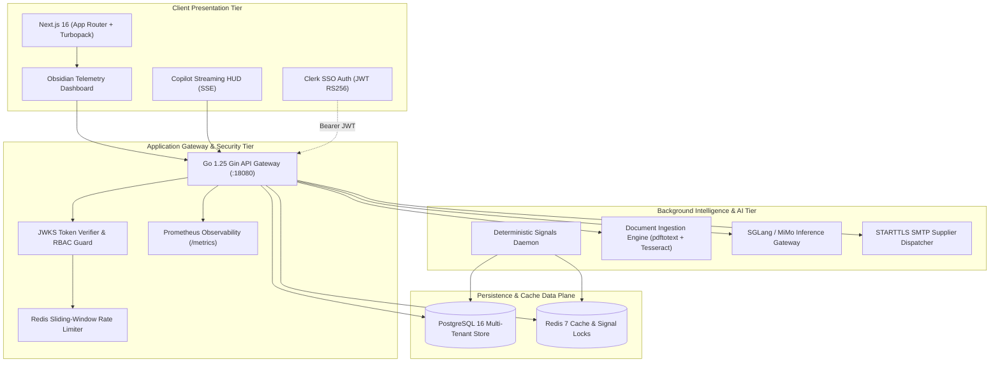

<div align="center">

# 🛰️ OpsPilot Lite
### Autonomous Operations Intelligence & Deterministic Risk Governance Engine

[](https://nextjs.org/)
[](https://golang.org/)
[](https://gin-gonic.com/)
[](https://www.postgresql.org/)
[](https://redis.io/)
[](https://clerk.com/)
[](https://tailwindcss.com/)
[](LICENSE)

<p align="center">
  <b>OpsPilot Lite</b> replaces fragmented spreadsheets and legacy ERPs with high-frequency operational telemetry, continuous deterministic risk evaluation, dual-signature Maker-Checker governance, and a strictly grounded AI copilot that never hallucinates facts.
</p>

[Key Features](#-key-features) • [System Architecture](#-system-architecture) • [Quick Start](#-quick-start) • [Governance & Security](#-governance--security) • [API Reference](#-api-reference)

---

</div>

## 🌌 Overview

Modern growing enterprises hemorrhage capital not from lack of effort, but from operational blind spots: uncoordinated supplier orders, aging accounts receivable, untracked stockout velocities, and unverified AI hallucinations.

**OpsPilot Lite** bridges the gap between raw transactions and executive action. It couples a hardened **Go 1.25 backend** with a reactive **Next.js 16 obsidian-themed HUD**, persisting multi-tenant operations inside **PostgreSQL 16** with atomic inventory movements, automated OCR document ingestion, and non-negotiable **Maker-Checker segregation of duties**.

---

## ⚡ Key Features

### 🎛️ 1. Obsidian Telemetry Command Center
- **Enterprise Dark-Mode HUD**: Inspired by aerospace telemetry dashboards with real-time operational metrics, interactive SVG sparklines, and status badges.
- **Dynamic KPI Stream**: Instant visibility into Monthly Recurring Revenue (MRR), Overdue Receivables, Inventory Velocity Index, and Active Risk Signals.
- **Seamless Clerk SSO Onboarding**: Zero-friction sign-in with automatic workspace detection and direct redirect into active operational dashboards.

### 🛡️ 2. Dual-Signature Maker-Checker Governance
- **Consequential Action Controls**: Large capital commitments and Purchase Order dispatches cannot be authorized by the creating officer.
- **Two-Stage Gatekeeping**: Distinct **Approve** and **Execute** pipelines logged immutably in an append-only audit trail.
- **Automated Supplier Dispatch**: Integrated STARTTLS SMTP email transmission directly to vendor contacts with full receipt reconciliation tracking.

### 🤖 3. Grounded AI Copilot (Zero-Drift Architecture)
- **Database Fact Grounding**: The LLM Copilot (powered by SGLang / MiMo) is strictly bound to verified PostgreSQL database state.
- **Zero Hallucination Tolerance**: Every generated recommendation and numerical explanation includes structured citations and verified counterparty references.
- **SSE Streaming**: Sub-second server-sent events streaming with real-time latency metrics and automated recommendation audit persistence.

### 📡 4. Autonomous Deterministic Signals Engine
- **Independent Coordinated Worker**: A background Go daemon continuously calculates:
  - 🔴 **Inventory Stockout Hazards**: Depletion trajectories based on rolling 30-day velocity.
  - 🟡 **Accounts Receivable Aging**: Overdue invoices categorized into 30/60/90+ day risk tranches.
  - 🔵 **Supplier Reliability Volatility**: Lead time variance and fulfillment failure rates.
- **Persisted Risk State**: Signals are indexed and surfaced before financial damage occurs.

### 📄 5. Universal Document Ingestion & OCR Pipeline
- **Tabular Importers**: High-throughput CSV and XLSX parser for bulk products, customers, suppliers, and historical ledger transactions.
- **Multi-Page PDF & OCR**: Native `pdftotext` extraction paired with local **Tesseract OCR** for scanned invoices and quotations.
- **Interactive Review Screen**: Real-time counterparty fuzzy matching, amount sanitization, and manual verification before immutable ledger commitment.

---

## 🏗️ System Architecture



---

## 📂 Repository Structure

```text
.
└── opspilot-lite/
    ├── backend/                   # Go 1.25 Gin REST API & Workers
    │   ├── cmd/
    │   │   ├── api/               # Main HTTP API Server entrypoint
    │   │   ├── worker/            # Background risk signals worker
    │   │   └── seed/              # Deterministic database seeder
    │   ├── internal/
    │   │   ├── actions/           # Maker-Checker governance & execution
    │   │   ├── ai/                # SGLang client, prompt grounding & SSE
    │   │   ├── auth/              # Clerk JWKS & RBAC middleware
    │   │   ├── customers/         # Customer ledger & receivables
    │   │   ├── dashboard/         # Aggregated operational KPIs
    │   │   ├── importer/          # CSV/XLSX & PDF Tesseract OCR service
    │   │   ├── inventory/         # Double-entry stock movements
    │   │   ├── invoices/          # Billing & invoice lifecycle
    │   │   ├── payments/          # Payment recording & atomic reversals
    │   │   ├── products/          # SKU catalog & reorder thresholds
    │   │   ├── purchaseorders/    # PO workflows, approvals & receipts
    │   │   ├── sales/             # Sales orders & stock deduction
    │   │   ├── server/            # Gin engine configuration & routing
    │   │   ├── signals/           # Continuous risk signals evaluator
    │   │   └── suppliers/         # Supplier directory & lead-time analytics
    │   ├── migrations/            # Versioned SQL schema migrations
    │   └── tests/                 # Integration and mock tests
    ├── frontend/                  # Next.js 16 App Router UI
    │   ├── app/                   # Next.js App Router (Layouts, Pages)
    │   ├── components/            # Reusable UI primitives & icons
    │   ├── features/              # Domain-specific modules
    │   │   ├── actions/           # Maker-Checker action approval center
    │   │   ├── ai/                # Ask OpsPilot copilot modal & streaming
    │   │   ├── dashboard/         # Executive KPI & telemetry ribbons
    │   │   ├── imports/           # Document upload & OCR verification
    │   │   ├── landing/           # Obsidian Telemetry landing page
    │   │   ├── signals/           # Operational risk signals stream
    │   │   └── ...                # Customers, Invoices, Orders, etc.
    │   └── services/              # Typed API clients & TanStack Query hooks
    ├── infrastructure/            # Docker compose & SGLang deployment scripts
    ├── scripts/                   # Development & seeding helper scripts
    ├── Makefile                   # Developer command orchestrator
    └── README.md                  # Detailed module documentation
```

---

## 🚀 Quick Start

### Prerequisites
- **Go**: `1.25+`
- **Node.js**: `24+` (npm 10+)
- **Docker & Docker Compose**: For PostgreSQL 16 & Redis 7
- **Poppler & Tesseract** *(Optional, for OCR)*: `sudo apt install poppler-utils tesseract-ocr`

### 1. Clone & Navigate

```bash
git clone https://github.com/Sarthak702-droid/OpsPilot-Lite.git
cd OpsPilot-Lite/opspilot-lite
```

### 2. Configure Environment

```bash
# Setup Backend Environment
cp .env.example .env

# Setup Frontend Environment
cp frontend/.env.example frontend/.env.local
```

### 3. Boot Infrastructure & Apply Migrations

```bash
# Start PostgreSQL (port 15432) and Redis (port 16379)
make db-up

# Execute database migrations
make migrate
```

### 4. Install Dependencies & Launch Development Server

```bash
# Install frontend node modules
npm --prefix frontend ci

# Run concurrent backend and frontend services
make dev
```

The system will start and be available at:
- **Frontend HUD**: `http://localhost:3000`
- **Backend REST API**: `http://localhost:18080`
- **Health Check**: `http://localhost:18080/health`
- **Prometheus Metrics**: `http://localhost:18080/metrics`

---

## 🧪 Testing & Validation

OpsPilot Lite enforces strict linting, type safety, and comprehensive test suites across both Go and TypeScript:

```bash
# Run unit & integration tests across both stacks
make test

# Run frontend linting & TypeScript typecheck
make lint

# Run backend Go builds
make build
```

---

## 🔒 Governance & Security

| Mechanism | Implementation Detail |
| :--- | :--- |
| **Authentication** | Clerk SSO with RS256 asymmetric signature verification via live JWKS. |
| **RBAC Authorization** | Granular multi-tenant roles: `OWNER`, `ADMIN`, `MANAGER`, and `MEMBER`. |
| **Segregation of Duties** | Dual-signature maker-checker model on high-value purchase orders. No self-approval. |
| **Rate Limiting** | Redis sliding-window counter protecting AI endpoints and financial mutations. |
| **Tenant Isolation** | Foreign-keyed row-level scoping guarantees complete cryptographic data separation. |
| **Audit Immutability** | Append-only audit logs recording every approval, rejection, and payment reversal. |

---

## 📊 Core API Endpoints

| Method | Endpoint | Access Level | Description |
| :--- | :--- | :--- | :--- |
| `GET` | `/health` | Public | System liveness probe |
| `GET` | `/metrics` | Public | Prometheus formatted runtime metrics |
| `GET` | `/api/dashboard` | Member+ | Aggregated MRR, inventory velocity, and risk KPIs |
| `GET` | `/api/signals` | Member+ | Active risk signals stream (stockout, overdue, vendor) |
| `POST` | `/api/actions/:id/approve` | Admin/Owner | Maker-checker dual-signature approval |
| `POST` | `/api/actions/:id/execute` | Admin/Owner | Atomic execution of approved actions |
| `POST` | `/api/import/pdf/preview` | Manager+ | Extract and preview invoice/quotation data |
| `POST` | `/api/import/pdf/commit` | Manager+ | Confirm and commit reviewed document to ledger |
| `POST` | `/api/ai/stream` | Member+ | Grounded SSE streaming copilot response with citations |

---

## 📜 License

Distributed under the **MIT License**. See `LICENSE` for more information.

---

<div align="center">
  <sub>Built with engineering precision by <b>Sarthak Tripathy</b> & the OpsPilot Community.</sub>
</div>
